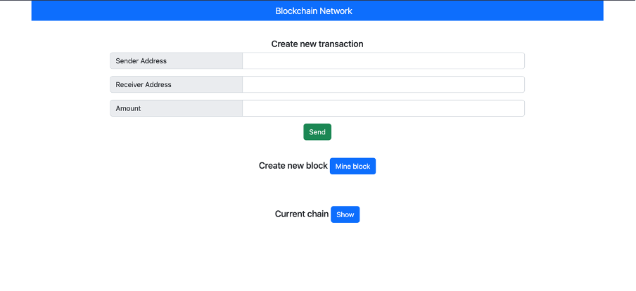
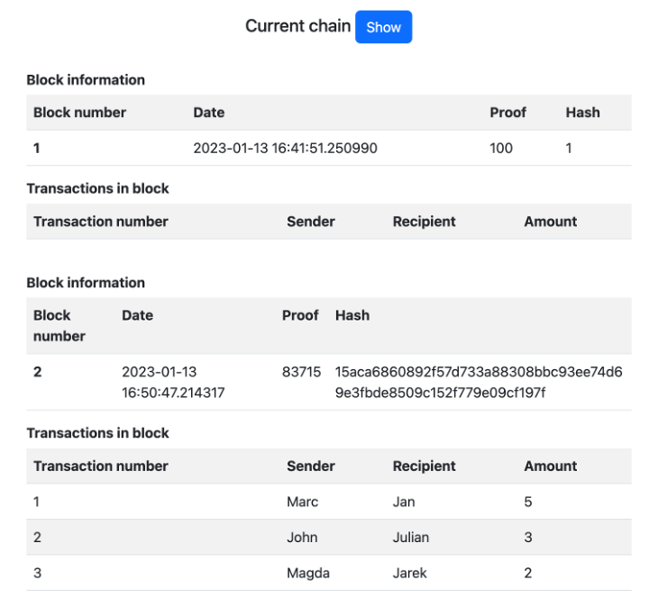

# BLOKCHAIN NETWORK

## Tabel of contents

* General info
* Technologies
* Setup
* How it works
* Copyrights

## General info

* Name

  * Full: Blokchain Network using flask
  * Short: Blokchain Network
* Purpose

  * Program is responsible for simple blockchain creation and transactions.
* Main features

  * Creates a new block in the network
  * Allows you to make a transaction
  * Displays the current block network
  * Decentralizes the network using
  * Creates a new node in the network

## Technologies

* PYTHON
 
  * Libraries
    * json
    * hashlib
    * time
    * urllib.parse
    * uuid
    * requests
    * flask (framework aplikacji webowych)
    * datetime
    * jinja2
* HTML/CSS

  * Framework Boostrap 5

## Setup

First download the repo on your local machine using git clone:

```
git clone https://github.com/Szymok/blockchain-network.git
```

Then navigate to repo and install dependencies:

```
pip install -r requirements.txt
```

To run program, open terminal and navigate to repo. Use following commands to run instances of our application:
For the first instance on port 4001:

```
FLASK_APP=blockchain.py flask run --port 4001
```

If you want to user other port just run with other number at the end.

Program will be running on port 4001. Now run line in your browser:

```
http://localhost:4001
```

## How it works



To create a transaction, enter:

* Own address
* Destination address
* Number of coins to send

After adding a few transactions, you can create a new block by pressing the "Mine Block" button, where all new transactions will be added:


If you want to check the current network, press the "Show" button. Each block contains: number, date, proof and hash. Under the information about the block there is information about all transactions.



## Limitations

The current version mainly presents the operation of the blockchain network, where, among others, creating a transaction, mining a block and displaying the current network.

## Planned features but not implemented

* Separating site by user and admin

  * User
    * User account with encryption
    * View history of transactions
    * View prices of choosen coins
  * Admin
    * Site managment

## Copyrights

* Authors
  * [Szymon Kowalewski](https://github.com/Szymok)
  * [Maciej Stasiłowicz](https://github.com/PilgrimMatthias)
  * Natalia Szarszewska
* License
  * This program is licensed under CC BY 4.0. To view a copy of this license go to:[ https://creativecommons.org/licenses/by/4.0/](https://creativecommons.org/licenses/by/4.0/)
